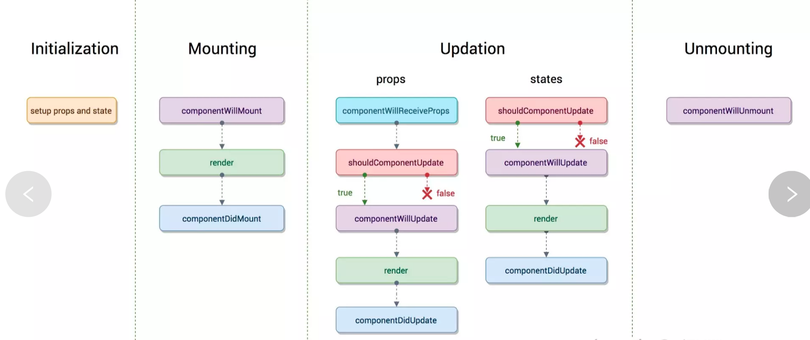

# v1.0 HelloWorld 和组件的讲解

# v1.1 React 中 JSX 语法简介:

> JSX 就是 Javascript 和 XML 结合的一种格式。React 发明了 JSX，可以方便的利用 HTML 语法来创建虚拟 DOM，当遇到<，JSX 就当作 HTML 解析，遇到{就当 JavaScript 解析.

# v1.2 React 实例-小姐姐服务菜单:

1. Fragment 标签讲解:

加上最外层的 DIV，组件就是完全正常的，但是你的布局就偏不需要这个最外层的标签怎么办?比如我们在作 Flex 布局的时候,外层还真的不能有包裹元素。这种矛盾其实 React16 已经有所考虑了，为我们准备了<Fragment>标签。

- 要想使用<Fragment>，需要先进行引入:
  import React,{Component,Fragment } from 'react'

* 然后把最外层的<div>标签，换成<Fragment>标签。

- 这时候你再去浏览器的 Elements 中查看，就回发现已经没有外层的包裹了。

# v1.3 React 实例-宝剑磨的好,理论不能少:

> 这节课我们主要了解一下 React 中的响应式设计原理和数据的绑定方法，俗话说的好："宝剑磨的好，理论不能少"。这节课我们不仅要编写效果，还要讲理论，这节课很重要，因为这涉及 React 中的设计思想和你以后的编程思路。

1. 响应式设计和数据的绑定:

   React 不建议你直接操作 DOM 元素,而是要通过数据进行驱动，改变界面中的效果。React 会根据数据的变化，自动的帮助你完成界面的改变。所以在写 React 代码时，你无需关注 DOM 相关的操作，只需要关注数据的操作就可以了（这也是 React 如此受欢迎的主要原因，大大加快了我们的开发速度）。

2. 绑定事件:

# v1.4 React 实例-老板我要加个钟:

> 有了上节课的基础，这节课终于可以添加服务，为所欲为了，随意增加你想要的服务了。这节课我们就来增加一个躺式采耳服务，体验一把帝王级待遇。

# v1.5 React 实例-宝剑虽然好 老腰受不了:

> 添加服务虽然很美妙，但是有时候也需要有些节制。这节课就学习如何删除一个服务选项。需求是这样的，当点击已经有的选项后，我们就进行删除。如果使用原生的 js 来写，这是非常麻烦的，但是有了 React 后就变的简单了。

# v1.6 React 进阶-JSX 防踩坑的几个地方:

> 这节课就讲一下 JSX 语法中需要注意的几个小坑:

**_1.JSX 代码注释:_**
JSX 中的代码注释是非常有讲究的，这个书上介绍的也非常少，所以在这里讲一下，因为技术胖在初学 React 在这里踩过坑。
我第一次写 JSX 注释，是直接这样写的，当然这样写是完全不对的。

```javascript
<Fragment>
  //第一次写注释，这个是错误的
  <div>
    <input
      value={this.state.inputValue}
      onChange={this.inputChange.bind(this)}
    />
    <button onClick={this.addList.bind(this)}> 增加服务 </button>
  </div>
```

那写 JSX 的注释，可以有下面两种写法:

```javascript
<Fragment>
    {/* 正确注释的写法 */}
    <div>
        <input value={this.state.inputValue} onChange={this.inputChange.bind(this)} />
        <button onClick={this.addList.bind(this)}> 增加服务 </button>
    </div>
```

如果你记不住，有个简单的方法，就是用 VSCode 的快捷键，直接按 Ctrl+/，就会自动生成正确的注释了。
你可以把这个理解为，在 jsx 中写 javascript 代码。所以外出我们套入了{}，然后里边就是一个多行的 javascript 注释。如果你要使用单行祝注释//，你需要把代码写成下面这样。

```javascript
<Fragment>
    {
        //正确注释的写法
    }
    <div>
        <input value={this.state.inputValue} onChange={this.inputChange.bind(this)} />
        <button onClick={this.addList.bind(this)}> 增加服务 </button>
    </div>
```

也就是你要进行换行，所以个人认为这种方法不太优雅，所以推荐第一种注释方法。

**_2.JSX 中的 class 陷阱:_**
比如要给朴素单纯的界面，加入黄色成分，让我们的文本框又粗又黄。我们先来错误演示。

第一步：先写一个 CSS 样式文件，在 src 目录下，新建一个 style.css 的样式文件。

> .input {border:3px solid #ae7000}

第二步：在 Xiaojiejie.js 里引入，先用 import 进行引入,能用 import 引入，都是 webpack 的功劳。

> import './style.css'

第三步：给 JSX 加入`class,注意下面的代码是错误的。

> <input class="input" value={this.state.inputValue} onChange={this.inputChange.bind(this)} />

虽然现在页面是可以正常显示结果的，但是你代开浏览器控制台会发现 Warning 警告。

```javascript
index.js:1437 Warning: Invalid DOM property `class`. Did you mean `className`?
    in input (at Xiaojiejie.js:19)
    in div (at Xiaojiejie.js:18)
    in Xiaojiejie (at src/index.js:5)
```

意思就是要把 class 换成 className，它是防止和 js 中的 class 类名 冲突，所以要求换掉。这也算是一个小坑吧。

**_3.JSX 中的 html 解析问题：_**

如果想在文本框里输入一个\<h1\>标签，并进行渲染。默认是不会生效的，只会把\<h1\>标签打印到页面上，这并不是我想要的。如果工作中有这种需求，可以使用 <font color="red">dangerouslySetInnerHTML</font> 属性解决。具体代码如下：

```javascript
<ul>
  {this.state.list.map((item, index) => {
    return (
      <li
        key={index + item}
        onClick={this.deleteItem.bind(this, index)}
        dangerouslySetInnerHTML={{ __html: item }}
      ></li>
    );
  })}
</ul>
```

**_4.JSX 中 \<label> 解析问题：_**

JSX 中<label>的坑，也算是比较大的一个坑，label 是 html 中的一个辅助标签，也是非常有用的一个标签。

先看下面的代码，我们在文本框前面加入一个<label>。

```javascript
<div>
  <label>加入服务：</label>
  <input
    className="input"
    value={this.state.inputValue}
    onChange={this.inputChange.bind(this)}
  />
  <button onClick={this.addList.bind(this)}> 增加服务 </button>
</div>
```

这时候想点击“加入服务”直接可以激活文本框，方便输入。按照 html 的原思想，是 input 中直接加 ID ，然后 label 中加入 for="input 对应的 id 值"．这个时候你点击 label 标签，就会激活 input 输入框．代码如下：

```javascript
<div>
  <label for="jspang">加入服务：</label>
  <input
    id="jspang"
    className="input"
    value={this.state.inputValue}
    onChange={this.inputChange.bind(this)}
  />
  <button onClick={this.addList.bind(this)}> 增加服务 </button>
</div>
```

这时候你浏览效果虽然可以正常，但 console 里还是有红色警告提示的。大概意思是不能使用 for.它容易和 javascript 里的 for 循环混淆，会提示你使用 <font color="red">htmlfor</font> 。

```javascript
<div>
  <label htmlFor="jspang">加入服务：</label>
  <input
    id="jspang"
    className="input"
    value={this.state.inputValue}
    onChange={this.inputChange.bind(this)}
  />
  <button onClick={this.addList.bind(this)}> 增加服务 </button>
</div>
```

这时候代码就正确了，可以实现点击\<label>后,激活\<input>标签了。
这节算是我总结的一些 JSX 中的坑吧，总结出来，希望小伙伴们少踩这些坑，能快速上手 React

# v1.7 React 进阶-Simple React Snippets:

> 这节课很短，但是我觉的有必要单独拿出一节来讲讲。在工作中你经常会看到程序老司机写代码是非常快的，甚至让你烟花缭乱，那他们真的是单身那么多年，练就了超级快手吗?当然不是，只是他们使用了快速生成插件，这节课我就向大家介绍一个 vscode 中的 Simple React Snippets，有了这个插件，稍加练习，你也可以像老司机一样，拥有加藤鹰的圣手(如果不懂请自行搜索吧)。

- vscode 中的 Simple React Snippets:

**_1．快速进行引入 import:_**

> 直接在 vscode 中输入 imrc，就会快速生成最常用的 import 代码:
> import React, { Component } from 'react';

**_２．快速生产 class:_**

> 在作组件的时候，都需要写一个固定的基本格式，这时候你就可以使用快捷键 cc.插件就会快速帮我们生成如下代码：

```javascript

class  extends Component {
    state = {  }
    render() {
        return (  );
    }
}

export default ;

```

# v1.8 React 进阶-组件的拆分:

> 现在的小姐姐服务菜单已经完美的制作好了，但是这从头到尾我们只用了一个组件，但是在实际工作中肯定是团队开发，我们会把一个大功能分成不同的组件。比如把文本框和按钮单独一个组件，把下面的服务列表单独一个组件，这涉及了一个组件拆分的能力和知识。这节课就把小姐姐服务菜单进行一个拆分。

# v1.9 父子组件的传递:

> 通过上节课的学习，已经把"小姐姐"组件做了一个基本的拆分，但是还不能实现随着输入，显示出输入的内容。这里涉及的是父组件向子组件传值。然后点击删除，就相当于子组件向父组件传值。这节课就主要学习一下父子组件传值的一些技巧。

# v1.10 单项数据流和其他:

> 这节课我们讲一些理论性的东西，比如：React 单项数据流、React 同其他框架共同工作和函数式编程的一些概念，这节课可能会稍显无聊，因为都是理论的东西，但是这些知识无论是在面试中，还是在工作中都会经常遇到，所以也是跳不过去的一节课。

**_1.单项数据流_**

React 的特性中有一个概念叫做“单项数据流”,可能刚刚接触 React 的小伙伴不太明白这个概念，还是拿出《小姐姐服务菜单》的 Demo，来给大家讲解。比如我们在父组件中可以直接把 <font color="#DAA520">this.state.list </font>传递过来。例如下面代码:

```javascript
<ul>
  {this.state.list.map((item, index) => {
    return (
      <XiaojiejieItem
        key={index + item}
        content={item}
        index={index}
        list={this.state.list} //这里这里这里！！！！！
        deleteItem={this.deleteItem.bind(this)}
      />
    );
  })}
</ul>
```

其实这样传是没有问题的，问题是你只能使用这个值，而不能修改这个值，如果你修改了，比如我们把代码写成这样：

```javascript
handleClick(){
    //关键代码——---------start
    this.props.list=[]
    //关键代码-----------end
    this.props.deleteItem(this.props.index)
}
```

就会报下面的错误；

```javascript
TypeError: Cannot assign to read only property 'list' of object '#<Object>'
```

意思就是 list 是只读的，单项数据流。那如果要改变这里边的值怎么办?其实上节课已经讲过了，就是通过传递父组件的方法。

**_２.和其他框架配合使用_**

> 有小伙伴问我，React 和 jquery 能一起使用吗？
> 答案：是可以的，React 其实可以模块化和组件化开发。看/public/index.html 文件，代码如下：

```html
<!DOCTYPE html>
<html lang="en">
  <head>
    <meta charset="utf-8" />
    <link rel="shortcut icon" href="%PUBLIC_URL%/favicon.ico" />
    <meta name="viewport" content="width=device-width, initial-scale=1" />
    <meta name="theme-color" content="#000000" />

    <link rel="manifest" href="%PUBLIC_URL%/manifest.json" />

    <title>React App</title>
  </head>
  <body>
    <noscript>You need to enable JavaScript to run this app.</noscript>
    <!--关键代码start-->
    <div id="root"></div>
    <!--关键代码end-->
  </body>
</html>
```

其实 React 只对这一个\<div>,外边的其他 DOM 并不受任何影响，比如我们在它的下方再写一个\<div>，然后查看效果。

```html
<div id="root"></div>
<div style="color:red">今天过的好开心，服务很满意！</div>
```

你可以在其他的 div 里加入任何内容，但是这种情况很少，我也不建议这么使用。希望小伙伴们还是统一技术栈。

**_3.函数式编程_**

> 在面试 React 时，经常会问道的一个问题是：函数式编程的好处是什么？
>
> 1. 函数式编程让我们的代码更清晰，每个功能都是一个函数。
> 2. 函数式编程为我们的代码测试代理了极大的方便，更容易实现前端自动化测试。

React 框架也是函数式编程，所以说优势在大型多人开发的项目中会更加明显，让配合和交流都得心应手。

总结:这节课虽然都是些理论知识，这些知识在面试中经常被问到，所以也是必须掌握的内容。

# v1.11 调试工具的安装及使用:

> 已经可以简单的写一些 React 代码了，在视频中，我也是经常使用 console.log 这种很二的形式来调试程序。其实 React 在浏览器端是有一个调试工具的，这就是 React developer tools，这个是 React 人必下的一个调试工具。这节课就主要学习一下 React developer tools 的下载和简单使用。

React developer tools 的三种状态:

- 灰色： 这种就是不可以使用，说明页面不是又 React 编写的。
- 黑色: 说明页面是用 React 编写的，并且处于生成环境当中。
- 红色： 说明页面是用 React 编写的，并且处于调试环境当中

# v1.12 PropTypes 校验传递值:

> 在父组件向子组件传递数据时，使用了属性的方式，也就是 props，但“小姐姐服务菜单”的案例并没有任何的限制。这在工作中时完全不允许的，因为大型项目，如果你不校验，后期会变的异常混乱，业务逻辑也没办法保证。

# v1.13 ref 的使用方法:

> 在编写组件中的方法时，经常会遇到语义化很模糊的代码，这对于团队开发是一个很大的问题。因为 review 代码或者合作时都会影响开发效率。或者到这核心成员离开，项目倒闭的严重影响。所以我们必须重视 react 代码当中的语义化。ref 是个不错的工具，快来学习一下吧。

# v1.14 生命周期讲解－１:

> React 的生命周期是非常重要的知识点，所以关于 React 声明周期的课程可以多看几遍，我也会尽量的把 React 的生命周期讲的细致。生命周期的课程我分成三节来讲，这样更容易让你理解．

**_React 生命周期图:_**


通过这张图你可以看到 React 声明周期的四个大阶段：

- Initialization:初始化阶段。
- Mounting: 挂在阶段。
- Updation: 更新阶段。
- Unmounting: 销毁阶段

**_什么是生命周期:_**
如果非要用一句话把生命周期函数说明白，我觉的可以用这句话来说明：

> 生命周期函数指在某一个时刻组件会自动调用执行的函数

举例：写的小姐姐的例子。里边的 <font color="red">render()</font>函数，就是一个生命周期函数，它在 state 发生改变时自动执行。这就是一个标准的自动执行函数。

- <font color="red">constructor</font>不算生命周期

<font color="red">constructor</font>我们叫构造函数，它是 ES6 的基本语法。虽然它和生命周期函数的性质一样，但不能认为是生命周期函数。

但是你要心里把它当成一个生命周期函数，我个人把它看成 React 的 <font color="red">Initialization</font> 阶段，定义属性（props）和状态(state)。

**_Mounting 阶段:_**

Mounting 阶段叫挂载阶段，伴随着整个虚拟 DOM 的生成，它里边有三个小的生命周期函数，分别是：

1. <font color="red">componentWillMount</font>在组件即将被挂载到页面的时刻执行。

2. <font color="red">render</font> :页面 state 或 props 发生变化时执行。

3. <font color="red">componentDidMount</font> :组件挂载完成时被执行。

- componentWillMount 代码:

```javascript
componentWillMount(){
    console.log('componentWillMount----组件将要挂载到页面的时刻')
}
```

- componentDidMount 代码:

```javascript
componentDidMount(){
    console.log('componentDidMount----组件挂载完成的时刻执行')
}
```

- render 代码:

```javascript

render(){
    console.log('render---组件挂载中.......')
}
```

这时候我们查看一下控制台，会为我们打出如下提示：

```javascript
componentWillMount----组件将要挂载到页面的时刻执行
render----开始挂载渲染
componentDidMount----组件挂载完成的时刻执行
```

这也是生命周期的顺序。有小伙伴会问我，这个函数书写有顺序吗?哪个在前？哪个在后？其实是没有顺序的，你可以随便改动他们的顺序。

**_注意的问题:_**
<font color="red">componentWillMount</font>和<font color="red">componentDidMount</font>这两个生命周期函数，只在页面刷新时执行一次，而<font color="red">render</font>函数是只要有 state 和 props 变化就会执行，这个初学者一定要注意。
视频中会举例说明。

> 总结:这节课讲解了 React 的生命周期函数，先是简单了解了一下 React 生命周期函数的四大阶段，然后又详细学习了一下 Mounting 挂载阶段中的三个生命周期函数。下节课会学习 Updation 阶段的生命周期函数。

# v1.15 生命周期讲解－2:

> 这节继续学习 React 生命周期中的 Updation 阶段,也就是组件发生改变的更新阶段，这是 React 生命周期中比较复杂的一部分，它有两个基本部分组成，一个是 props 属性改变，一个是 state 状态改变（这个在生命周期的图片中可以清楚的看到）。

**_shouldComponentUpdate 函数:_**
<font color="red">shouldComponentUpdate</font>函数会在组件更新之前，自动被执行。比如写入下面的代码:

```javascript
shouldComponentUpdate(){
    console.log('shouldComponentUpdate---组件发生改变前执行')
}
```

它要求返回一个布尔类型的结果，必须有返回值，这里就直接返回一个 true 了（真实开发中，这个是有大作用的）。

```javascript
shouldComponentUpdate(){
    console.log('shouldComponentUpdate---组件发生改变前执行')
    return true
}
```

现在就可以在控制台 console 里看到结果了，并且结果是每次文本框发生改变时都会随着改变。如果你返回了 false，这组件就不会进行更新了。<font color="red"> 简单点说，就是返回 true，就同意组件更新;返回 false,就反对组件更新。</font>

**_componentWillUpdate 函数:_**

<font color="red">componentWillUpdate</font>在组件更新之前，但<font color="red">shouldComponenUpdate</font>之后被执行。但是如果<font color="red">shouldComponentUpdate</font>返回 false，这个函数就不会被执行了。

```javascript
//shouldComponentUpdate返回true才会被执行。
componentWillUpdate(){
    console.log('componentWillUpdate---组件更新前，shouldComponentUpdate函数之后执行')
}
```

**_componentDidUpdate 函数:_**
<font color="red">componentDidUpdate</font>在组件更新之后执行，它是组件更新的最后一个环节。

```javascript
componentDidUpdate(){
    console.log('componentDidUpdate----组件更新之后执行')
}
```

为了方便我们看出结果，可以在每个函数前加上序号。最后我们可以看到控制台输出的结果如下：

```javascript
1-shouldComponentUpdate---组件发生改变前执行
2-componentWillUpdate---组件更新前，shouldComponentUpdate函数之后执行
3-render----开始挂载渲染
4-componentDidUpdate----组件更新之后执行
```

结果和我们写的顺序也是相对的，讲到这里，你一定对 React 的生命周期函数有了比较直观的了解了。

**_componentWillReceiveProps 函数:_**
我们可以先在 <font color="red">Xiaojiejie.js</font> 组件里写下这个函数，例如下面的代码。

```javascript
componentWillReceiveProps(){
    console.log('componentWillReceiveProps')
}
```

这时候会发现函数什么时候都不会被执行，因为 <font color="red">Xiaojiejie.js</font> 算是一个顶层组件，它并没接收任何的 <font color="red">props</font>。可以把这个函数移动到 <font color="red">XiaojiejieItem.js</font> 组件中。

凡是组件都有生命周期函数，所以子组件也是有的，并且子组件接收了<font color="red">props</font>，这时候函数就可以被执行了。

```javascript
componentWillReceiveProps(){
        console.log('child - componentWillReceiveProps')
    }
```

这个时候再预览，就会看到 <font color="red">componentWillReceiveProps</font> 执行了。那现在可以总结一下它的执行时间了。

子组件接收到父组件传递过来的参数，父组件 render 函数重新被执行，这个生命周期就会被执行。

- 也就是说这个子组件第一次存在于 Dom 中，函数是不会被执行的（即：第一次渲染这个子组件的时候，这个函数是不会被执行的）;
- 如果已经存在于 Dom 中，函数才会被执行（即：只有发生变化的时候，第二次渲染的时候，这个函数才会被执行）。

这个生命周期算是比较复杂的一个生命周期，需要我们花点时间去消化。

# v1.16 生命周期讲解-3:

> 其实这节课算是一个小的补充，把最后一个 React 的生命周期函数讲一下，这个生命周期周期函数就是 <font color="red">componentWillUnmount</font>，它是在组件去除时执行。

**_componentWillUnmount 函数:_**
这个函数时组件从页面中删除的时候执行，比如在 XiaojiejieItem.js，写入下面的代码:

```javascript
//当组件从页面中删除的时候执行
componentWillUnmount(){
    console.log('child - componentWillUnmount')
}
```

写完后，可以到浏览器终端中查看结果，当我们点击服务项，服务项被删除时，这个函数就被执行了。
总结:通过三节课的学习，我们已经把 React 的所有生命周期函数都讲完了，下节课会具体讲一下生命周期函数在实际开发中的应用。

# v1.17 生命周期改善程序性能：

> 已经对 React 生命周期有了认识，那如何利用它提高组件的性能那？这节课我们会讲一个通过 <font>shouldComponentUpdate</font> 函数，改善 React 组件性能的例子。为了让这节课讲述的内容更加清晰，可以删除上几节课的生命周期函数。
